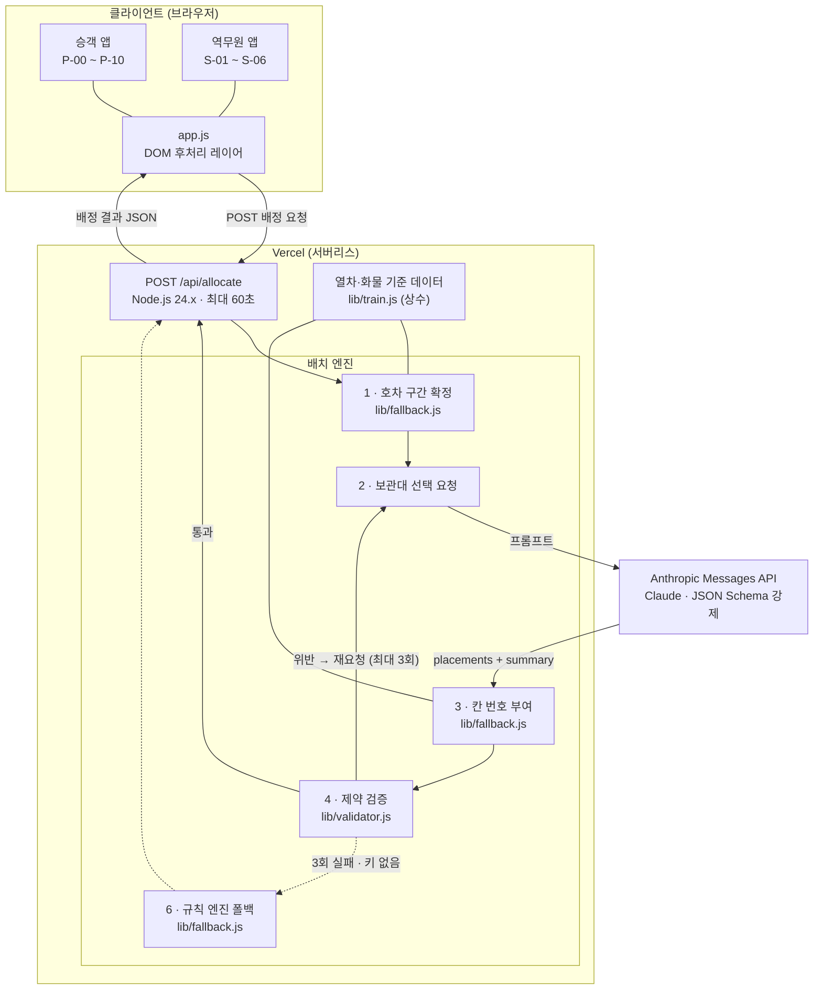

# 짐콕 — 서비스 구성도 · 기술스택 · 모델 및 프롬프트

> KTX 수하물·특송 AI 적재 배정 서비스
> 배포: https://ktx-luggage-app-v2-source.vercel.app
> 저장소: https://github.com/ans13i/re_move_jimcok

---

## 서비스 구성도



**핵심 설계 원칙 — AI는 제안, 확정은 코드와 사람**

| 단계 | 담당 | 하는 일 |
| --- | --- | --- |
| 1 | 코드 | 하차역별 호차 구간 확정 (변경 불가 제약으로 고정) |
| 2 | **Claude** | 각 화물을 **어느 보관대에** 둘지 선택 |
| 3 | 코드 | 보관대 안에서 **칸 번호(01~06)** 부여 |
| 4 | 코드 | 11종 제약 검증 |
| 5 | 코드 | 위반 시 위반 내역을 붙여 재요청 (최대 3회) |
| 6 | 코드 | 최종 실패·키 없음 시 규칙 엔진 폴백 |
| 7 | 역무원 | 배정안 최종 확정 |

AI에게는 **보관대 선택이라는 판단 문제만** 맡기고, 계산·번호 부여·검증은 전부 코드가 담당합니다. 그래서 AI가 실패해도 서비스는 멈추지 않고 항상 유효한 배치안을 반환합니다.

---

## 기술스택

### Frontend

| 항목 | 내용 |
| --- | --- |
| 라이브러리 | React 19.2 (SPA, 클라이언트 렌더링) |
| 빌드 도구 | Vite 8.2 + @vitejs/plugin-react 6.0 |
| 언어 | TypeScript 5.9 |
| 스타일 | Tailwind CSS 4.3 (@tailwindcss/postcss) + 커스텀 CSS |
| 아이콘 | 인라인 SVG (외부 아이콘 라이브러리 없음) |
| 구조 | `app/page.tsx` 화면 17종 · `app.js` DOM 후처리 레이어 · `lib/*.js` 도메인 로직 |

승객 앱(P-00~P-10)과 역무원 앱(S-01~S-06)을 한 프로토타입에 담아 좌측 내비게이션으로 전환합니다. `app.js`는 React가 그린 DOM에 실제 배정 결과를 채워 넣는 얇은 레이어로, MutationObserver로 리렌더에 대응합니다.

### Backend

| 항목 | 내용 |
| --- | --- |
| 런타임 | Vercel Serverless Functions (Node.js 24.x) |
| 엔드포인트 | `POST /api/allocate` 단일 함수 |
| 최대 실행 시간 | 60초 (`vercel.json`) |
| 프레임워크 | 없음 — Node 표준 핸들러 (`@vercel/node` 타입만 사용) |
| 도메인 모듈 | `lib/train.js` 열차 모델 · `lib/fallback.js` 규칙 엔진 · `lib/validator.js` 검증 · `lib/claude.js` AI 호출 |

**시간 예산 설계** — AI 전체 45초, 1회 호출 20초, 시도 3회. 예산을 넘기면 남은 시도를 포기하고 규칙 엔진으로 넘어갑니다. 어떤 경우에도 HTTP 200과 유효한 배치안을 반환합니다.

### DB

**사용하지 않습니다.** 발표·시연용 프로토타입이라 영속 저장소를 두지 않았습니다.

| 데이터 | 보관 위치 |
| --- | --- |
| 열차 편성·보관대 구조·특송 화물 목록 | `lib/train.js` 상수 (서버 코드에 내장) |
| 승차권·수하물 등록 정보 | 브라우저 React state (`window.__jimkkok`으로 `app.js`에 노출) |
| 배정 결과 | 요청마다 새로 계산 (무상태) |

실서비스로 확장할 경우 승차권·수하물 등록 정보와 배정 이력에 영속 저장소가 필요합니다.

### AI Model

| 항목 | 내용 |
| --- | --- |
| 제공자 | Anthropic |
| SDK | `@anthropic-ai/sdk` 0.116 |
| API | Messages API (`client.beta.messages.create`) |
| 요청 모델 | `claude-opus-5` |
| 추론 강도 | `medium` (환경변수 `CLAUDE_EFFORT`로 변경 가능) |
| 출력 형식 | JSON Schema 강제 (`output_config.format`) |
| 최대 토큰 | 16,000 |
| 키 관리 | 서버 환경변수 `ANTHROPIC_API_KEY` — 클라이언트 번들에 포함되지 않음 |

---

## 7. 모델 및 프롬프트

### 사용 모델 또는 AI 제품

**Anthropic Claude — Messages API 직접 호출** (`claude-opus-5`, 추론 강도 medium)

챗봇 제품이나 에이전트 프레임워크를 쓰지 않고, 서버리스 함수에서 Messages API를 한 번 호출하는 단순한 구조입니다. AI가 담당하는 범위가 "보관대 선택" 하나로 좁아서 대화 상태나 도구 호출이 필요하지 않습니다.

> **참고 (실측)** — 코드는 `claude-opus-5`를 요청하지만, 안전 분류기 거부 시 자동 우회를 위해 server-side fallback 베타(`server-side-fallback-2026-07-01`)를 켜 두었습니다. 그 결과 배포 환경의 실제 응답 모델은 `claude-opus-4-8`로 기록됩니다. 배정 품질에는 문제가 없으나, 반드시 Opus 5로 고정해야 한다면 `lib/claude.js`에서 `betas`·`fallbacks` 옵션을 제거하면 됩니다.

### 모델 선택 이유

| 이유 | 설명 |
| --- | --- |
| **제약 조건 추론** | 호차 구간·특대형 하단 제한·승객 전용 칸 등 4개 제약을 동시에 만족시키면서 4개 최적화 목표의 우선순위를 지켜야 합니다. 규칙만으로는 "좌석에서 가까우면서 하차역별로 모으고 특정 호차에 몰리지 않는" 절충을 표현하기 어렵습니다. |
| **구조화 출력 지원** | JSON Schema로 응답 형식을 강제할 수 있어 파싱 실패가 없습니다. `rack` 필드는 enum으로 못 박아 존재하지 않는 보관대를 애초에 만들 수 없게 했습니다. |
| **한국어 설명 품질** | 역무원에게 보여줄 배정 사유와 요약을 한국어로 자연스럽게 씁니다. |
| **재요청 대응력** | 위반 내역을 붙여 다시 물었을 때 문제된 배정만 고치고 나머지는 유지하는 지시를 잘 따릅니다. |
| **응답 속도** | 배치 제약을 코드가 잡아주므로 추론 강도 `medium`으로 충분합니다. 실측 8초대로 시연에 무리가 없습니다. |

### 프롬프트 설계

**시스템 프롬프트 — 역할과 규칙 (고정)**

1. **역할 한정** — "당신이 정하는 것은 어느 보관대인가뿐입니다. 칸 번호는 시스템이 부여하므로 절대 지정하지 마세요. 잔여 용적도 이미 계산되어 주어지므로 다시 계산하지 마세요."
2. **지켜야 할 제약 4가지** — 하차역 호차 구간 / 특대형은 하단 칸만 / 승객 전용 칸에 특송 금지 / 보관대 잔여 칸 수 초과 금지
3. **최적화 목표 4가지 (우선순위 명시)** — ① 좌석-보관대 이동거리 최소화 ② 하차역별 집중 ③ 특정 호차 몰림 방지 ④ 자투리 공간 최소화
4. **오해 차단** — 호차마다 보관대가 하나뿐임을 명시해 "출입구에 더 가까운 보관대" 같은 존재하지 않는 선택지를 배제
5. **환각 금지** — "주어진 데이터에 없는 사실을 지어내지 마세요"

**유저 프롬프트 — 매 요청 조립 (`buildAllocationPrompt`)**

```
## 열차          KTX 123 · 서울 → 광교 → 대전 → 동대구 → 부산
## 하차역별 호차 구간 (확정 — 변경 불가)
## 잔여 공간 (시스템 계산값 — 다시 계산하지 마세요)
## 선택 가능한 보관대   빈 칸 수 · 상단/하단 · 가장 큰 빈 칸
## 배정할 화물          id · 종류 · 부피 · 특대형 여부 · 하차역 · 좌석
## 직전 시도에서 발견된 위반 — 반드시 고치세요   (재요청일 때만)
```

**설계 의도 세 가지**

- **계산은 미리 끝내서 값으로 준다** — 잔여 용적·빈 칸 수·사용률을 코드가 계산해 넣습니다. AI에게 산수를 시키지 않으니 오류가 줄고 응답도 빨라집니다.
- **선택지를 애초에 좁힌다** — 빈 칸이 없는 보관대는 목록에서 빼고, 스키마의 `rack` enum에도 넣지 않습니다.
- **실패를 학습 신호로 되먹인다** — 검증에서 걸린 위반 코드와 상세를 그대로 붙여 재요청합니다. "문제없던 배정은 그대로 두어도 됩니다"라고 명시해 전체 재배치를 막습니다.

---

### AI 역할

**각 수하물·특송 화물을 어느 보관대에 배정할지 결정하고, 그 이유를 한국어로 설명한다.**

| 하는 일 | 하지 않는 일 |
| --- | --- |
| 화물별 보관대(`5-A`, `7-B`, `9-C`, `12-D`) 선택 | 칸 번호(01~06) 지정 → **코드** |
| 선택 이유 한 줄 작성 (40자 이내) | 잔여 용적 계산 → **코드** |
| 전체 배치 요약 한 문장 작성 | 하차역별 호차 구간 결정 → **코드** |
| 위반 지적 시 해당 배정만 수정 | 제약 위반 여부 판정 → **코드** |
| | 최종 확정 → **역무원** |

### 입력값

| 항목 | 내용 |
| --- | --- |
| 열차 | 편성 번호, 출발역, 정차역 순서 |
| 하차역별 호차 구간 | 역마다 배정된 호차 범위와 총 부피 (확정값) |
| 잔여 공간 | 전체/사용/안전여유(10%)/배정 가능 용적, 빈 칸 수, 호차별 사용률 |
| 선택 가능한 보관대 | 보관대 키, 빈 칸 수(상단/하단), 가장 큰 빈 칸 용적, 사용 불가 칸 수 |
| 배정할 화물 | id, 종류(승객/특송), 부피(L), 특대형 여부, 하차역, 좌석(승객만) |
| 직전 위반 내역 | 재요청 시에만. 위반 코드 11종 (`DEST_RACK`, `UPPER_XLARGE`, `PAX_LOCKED`, `SLOT_OVERFLOW`, `DWELL_TIME` 등) |

### 출력값

JSON Schema로 형식을 강제합니다 (`additionalProperties: false`).

```json
{
  "placements": [
    { "itemId": "string", "rack": "enum(선택 가능한 보관대만)", "reason": "한국어 한 줄, 40자 이내" }
  ],
  "summary": "역무원에게 알리는 한국어 한 문장"
}
```

`placements`는 배정할 화물 전건에 대해 정확히 하나씩 있어야 하며, 빠지면 실패로 처리해 재요청합니다.

### 예시

**입력 (유저 프롬프트 발췌)**

```
## 열차
KTX 123 · 서울 → 광교 → 대전 → 동대구 → 부산

## 하차역별 호차 구간 (확정 — 변경 불가)
- 광교 (1번째 정차): 5~5호차 · 총 45L
- 대전 (2번째 정차): 7~7호차 · 총 135L

## 잔여 공간 (시스템 계산값 — 다시 계산하지 마세요)
전체 2160L · 사용 0L · 안전여유 216L · 배정 가능 1944L
빈 칸 24 / 24

## 선택 가능한 보관대
- 5-A: 빈 칸 6개(상단 3 / 하단 3) · 가장 큰 빈 칸 105L
- 7-B: 빈 칸 6개(상단 3 / 하단 3) · 가장 큰 빈 칸 105L

## 배정할 화물
- G02 · [특송] · 45L · 일반 · 광교 하차
- A13 · [특송] · 95L · 특대형(하단만) · 대전 하차
```

**AI 출력**

```json
{
  "placements": [
    { "itemId": "G02", "rack": "5-A", "reason": "광교 하차 구간 5호차 보관대" },
    { "itemId": "A13", "rack": "7-B", "reason": "대전 구간, 특대형이라 하단 칸 필요" }
  ],
  "summary": "모든 화물을 하차역 호차 구간에 맞게 배정했고 특대형은 하단 칸에 두었습니다."
}
```

**코드가 칸 번호를 부여하고 검증한 최종 결과 (API 응답 발췌 — 실측)**

```json
{
  "source": "llm",
  "summary": "모든 화물을 하차역 호차 구간에 맞게 배정했고 특대형은 하단 칸에 두었습니다.",
  "attempts": [{ "label": "llm-1", "ok": true, "model": "claude-opus-4-8" }],
  "allocations": [
    {
      "itemId": "G02",
      "slotId": "5-A-01",
      "car": 5, "rack": "A", "index": 1,
      "label": "5호차 A보관대 01칸",
      "kind": "freight", "destination": "광교", "volumeL": 45
    }
  ],
  "violations": []
}
```

승객 수하물에는 좌석에서 보관대까지의 도보 거리(`distanceM`)가 함께 붙습니다. 승객 앱 P-01의 "수하물 위치" 칸에는 `slotId`에서 뽑은 칸 번호(예: `D-04`)가, 안내 박스에는 `label`과 도보 거리가 표시됩니다.

**응답의 `source` 값**

| 값 | 의미 |
| --- | --- |
| `llm` | 첫 요청에서 검증 통과 |
| `llm-retry` | 재요청 끝에 검증 통과 |
| `fallback` | AI 3회 실패 또는 API 키 없음 → 규칙 엔진 결과 |
